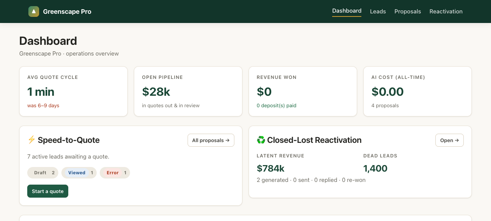
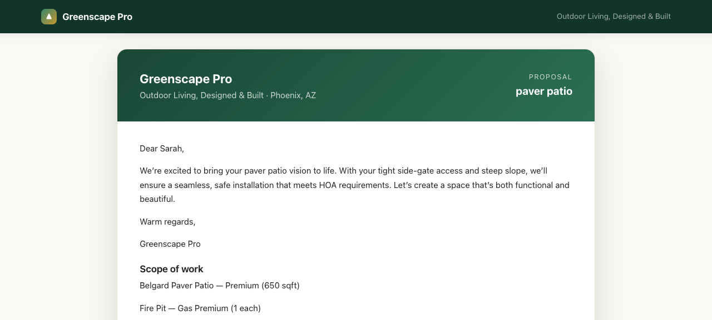
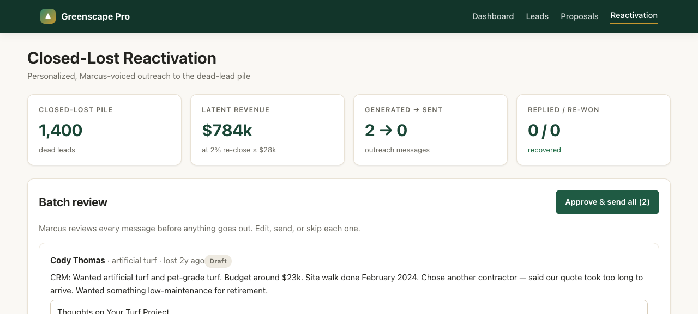

# Greenscape Pro — AI Agents

### Convert site-walk notes into an **approved proposal in hours, not 6–9 days.**

Two production AI agents (plus a 5-agent strategy) built for **Greenscape Pro** — a Phoenix high-end
hardscape/landscape design-build company — for the **License & Scale** AI Developer take-home.

**🌐 Live:** https://greenscape.licensescale.com  ·  **📄 Strategy:** [`STRATEGY.md`](./STRATEGY.md)  ·  **🎬 Walkthrough:** [`LOOM.md`](./LOOM.md)



---

## The problem (from the client's own words)

Greenscape Pro does ~$4.2M/yr, ~150 projects at a $28k average. On the discovery call the founder, Marcus, said:

> *"I am the bottleneck. I have to touch every proposal. Nobody else knows how to turn site-walk notes into a scope."*

Quotes take **6–9 days**, and **35–40% of qualified deals are lost to faster competitors** during the proposal
stage. The business isn't lead-constrained — it's **quote-constrained and founder-constrained.** Everything
here follows from that.

## The fix — 5 agents, ranked by leverage (not the founder's gut)

| # | Agent | What it is | Status |
|---|---|---|---|
| **1** | **Speed-to-Quote Agent (P0)** | **Revenue recovery engine** — site-walk notes → priced, brand-voiced, approved proposal in minutes. | ✅ **Built & live** |
| **2** | **Closed-Lost Reactivation Agent** | 1,400 lost leads represent huge **latent revenue**; personal, founder-voiced re-engagement. | ✅ **Built & live** |
| **3** | **Post-Sign Follow-Up Agent** | Automates **HOA, permits, deposits, customer nudges** after signing. | 🗺️ Roadmap |
| **4** | **Project Update Agent** | Automated customer communication from **CompanyCam / Jobber** milestones. | 🗺️ Roadmap |
| **5** | **Lead Qualification Agent** | **Filters tire-kickers** before Marcus gets involved. | 🗺️ Roadmap |

Full ROI math, interdependencies, and the explicit pushback on the founder's stated priorities are in
**[`STRATEGY.md`](./STRATEGY.md)**. (Short version: the founder's stated #1 was "quote faster" — the data says
the real fix is *removing him from drafting entirely*; we also demote his crew-coaching idea and delete his
marketing idea, and insert Reactivation, which he never mentioned, at #2.)

---

## #1 — Speed-to-Quote Agent (the P0, built)

**Goal: an approved proposal in hours instead of 6–9 days.** Marcus stops *drafting* proposals and starts
*approving* them.

```
Lead arrives (Meta/GHL webhook)
   └─ Marcus pastes/dictates site-walk notes  →  [Generate]
        1. AI extracts a structured scope from the messy notes        (local qwen3:8b / Claude Haiku)
        2. Code maps it to the 145-item pricing catalog & PRICES it   (deterministic — the AI never prices)
        3. AI writes the proposal prose (cover note, scope, in/exclusions)  (qwen3:8b / Claude Sonnet)
   └─ status: needs_review  →  Marcus edits & Approves           (human-in-the-loop)
        4. SES emails the customer a branded proposal + a PayPal 50% deposit link
   └─ /p/:token (public, shareable)  →  viewed  →  deposit_paid  →  lead = won
```

Generation runs in the background and the page auto-refreshes — no hanging request. If the model fails, the
proposal still lands **fully editable** (never a 500).

### Real end-to-end run (on the local GB10 model, $0)

A lead arrived → site-walk notes → **a $28,068.54 proposal in ~1 minute**, sent to a live customer page:

| | |
|---|---|
| Belgard Premium pavers, 650 sqft | $13,455.00 |
| Custom gas fire pit | $6,912.00 |
| Demo + haul old concrete (haul-off line **auto-flagged low-confidence** for review ✓) | $2,158.00 |
| Cafe string lights, 120 lf + 4 up-lights | $3,320.80 |
| **Total** (subtotal $25,845.80 + 8.6% tax) | **$28,068.54** · deposit $14,034.27 |

The AI cover note was grounded in the actual notes ("…your tight side-gate access and steep slope, we'll
ensure a … installation that meets HOA requirements…").



---

## #2 — Closed-Lost Reactivation Agent (built)

Pick closed-lost leads → the AI writes a **personal, Marcus-voiced** message grounded in each lead's real CRM
notes (it self-reports `uses_real_context`; generic drafts are flagged) → **Marcus approves the batch** → SES
sends → track `sent → replied → re-won`. Lost Speed-to-Quote proposals flow *back* into this pile.

> *Example generated message:* "Cody, hope you're doing well. Just wanted to check in about your turf project —
> I remember you were looking for something low-maintenance for retirement… I know you ended up going with
> another contractor because our quote took too long to arrive, but I'd love to hear if you're still thinking
> about it?"



---

## The one rule that defines the architecture

**The LLM never computes a price.** Claude/qwen decides *which* catalog items apply and *how much* of each;
**every dollar is a deterministic, unit-tested TypeScript function of integer cents** read from the database.
A hallucinated price on a $42k contract is structurally impossible — the worst case is a line flagged
*needs-review*, never a wrong number sent. See [`src/pricing/compute.ts`](./src/pricing/compute.ts).

This is also why a small **local 8B model is trustworthy here**: it only has to choose SKUs + quantities
(structured output the server *forces* to a schema), code does the math, and anything uncertain is flagged for
a human. Good-enough extraction → trustworthy output.

## Stack

- **Runs two ways from one codebase:** self-hosted **Node + libSQL** (current production) *or* **Cloudflare Workers + D1** (edge). `getDb` transparently accepts a D1 binding or an injected Drizzle instance; [`src/server.ts`](./src/server.ts) is the Node entry.
- **Hosting:** a self-hosted Node service behind a **Cloudflare Tunnel** → greenscape.licensescale.com.
- **LLM (pluggable):** **local Ollama `qwen3:8b` on an NVIDIA GB10 — $0/proposal, no API key** *(default)*, or **Claude** (Haiku extraction + Sonnet prose). One env var, `LLM_PROVIDER`, flips between them; both are asked for JSON matching the same schemas.
- **Voice-to-text (Dictate):** **self-hosted Whisper** (faster-whisper `small.en` in Docker, ffmpeg-decoded) — speak your site-walk notes in the browser and they're transcribed on-box (~2–3s). No cloud STT, no API key. The whole *speak → priced proposal* pipeline runs on the one GB10 at **$0/quote**. Gated on `WHISPER_URL`.
- **DB:** **libSQL/SQLite** (or D1) via **Drizzle ORM** + SQL migrations — real persistence, money as integer cents.
- **Integrations:** **Amazon SES** (email, SigV4 via `aws4fetch`) + **PayPal Orders v2** (deposit checkout).
- **UI:** **Hono** server-rendered pages + a hand-written CSS design system (no framework).

## Guardrails (what happens when the model misbehaves)

| Risk | Guardrail |
|---|---|
| Model returns prose instead of data | schema-forced structured output (Ollama `format` / Anthropic forced tool-use) |
| Schema-valid but wrong | Zod re-validation after the model |
| Hallucinated SKU / invented price | SKU must exist in the catalog or it's flagged `unmapped` at $0; prices only from DB |
| Low-confidence / missing quantity | per-item confidence + flags; pessimistic overall confidence; `needs_review` gate |
| Transient model failure | one retry w/ backoff, then a fully-editable manual fallback |
| Integration down (SES/PayPal) | isolated try/catch + event log; the flow still advances |
| Empty/garbage notes | `no_scope_found` → "add items manually," not a crash |

## Cost

**Local (default): $0/proposal** — qwen3:8b on the GB10. Cloud option: ~$0.03/proposal (Haiku extraction +
Sonnet prose), ~$3–4/month at 150/mo. Per-proposal cost is logged to `proposals.llm_cost_cents` and shown on
the dashboard. The expensive resource being saved is Marcus's 6–9 days, not tokens.

## Run locally

```bash
npm install
cp .dev.vars.example .dev.vars                 # see .env.example for every variable
# Cloudflare Workers path:
npm run db:migrate:local && npm run db:seed:local && npm run dev    # http://localhost:8787
# OR plain Node + local SQLite:
npm run build:node && DATABASE_URL=file:./data/greenscape.db npm run db:setup:node && npm run start:node
npm test                                        # 24 tests: pricing, scope mapping, state machine
```

`seed/seed.sql` is generated deterministically by `node seed/generate-seed.mjs` (145 catalog items + 1,400
closed-lost leads). To use a local LLM: set `LLM_PROVIDER=local`, `OLLAMA_BASE_URL=http://localhost:11434`,
`LOCAL_LLM_MODEL=qwen3:8b`. To use Claude: set `ANTHROPIC_API_KEY` (provider defaults to anthropic).

## Deploy — self-hosted Node + Cloudflare Tunnel (current production)

```bash
npm run build:node
DATABASE_URL=file:./data/greenscape.db npm run db:setup:node     # migrate + seed libSQL
# create .env (PORT, HOST, PUBLIC_BASE_URL, DATABASE_URL, ADMIN_PASSWORD, LLM_PROVIDER, OLLAMA_BASE_URL, ...)
pm2 start dist/server.mjs --name greenscape --cwd "$PWD"
cloudflared tunnel create greenscape
cloudflared tunnel route dns greenscape greenscape.licensescale.com
cloudflared tunnel --config ~/.cloudflared/config-greenscape.yml run greenscape   # ingress → http://localhost:8787
```
Secrets load from `.env` at startup — add Anthropic/AWS/PayPal keys there and `pm2 restart greenscape`, no rebuild.

## Repo layout

```
src/
  pricing/      compute.ts (deterministic $), mapScope.ts (guardrails), types.ts
  ai/           client.ts (provider switch: Ollama | Anthropic), extract.ts, draft.ts,
                reactivate.ts, prompts.ts, schemas.ts, models.ts
  services/     proposals.ts, reactivation.ts, leads.ts, ses.ts, paypal.ts,
                dashboard.ts, settings.ts, catalog.ts, stateMachine.ts, events.ts
  routes/       webhook.ts, admin.tsx, proposals.tsx, reactivation.tsx, public.tsx
  ui/           layout / landing / dashboard / proposal / public / reactivation / components (Hono JSX)
  db/           schema.ts (Drizzle), client.ts   ·   server.ts (Node entry)
seed/           generate-seed.mjs → seed.sql        scripts/  db-setup.mjs
test/           pricing · mapScope · stateMachine (Vitest)
docs/screenshots/  live UI captures
```

## Trade-offs & what's next

- **Wire GoHighLevel** — the client insists "everything has to be in GHL." The code isolates that behind a clean adapter boundary (webhook in/out) but isn't yet connected to a live GHL tenant.
- **SES + PayPal go-live** — the agents currently generate + approve + publish proposals fully; turning on actual email delivery + real deposit checkout is dropping `AWS_*` / `PAYPAL_*` into `.env` (+ a verified SES sender) and `pm2 restart`.
- **Catalog sync is the first maintenance burden** — extraction is only as good as the loaded catalog; next is few-shot extraction tuned on Marcus's real past proposals.
- **Reply tracking** for reactivation (SES inbound / GHL webhook) instead of the manual "mark replied."

---

*Built by **License & Scale**. Speed-to-Quote + Closed-Lost Reactivation, deployed, persistent, human-in-the-loop, real LLM + integrations.*
