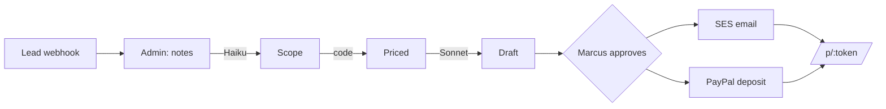

# Greenscape Pro — AI Agents

Two production AI agents for **Greenscape Pro**, a Phoenix high-end hardscape/landscape design-build company,
built for the **License & Scale** AI Developer take-home.

**Live:** https://licenseandscale.mikee.ai · **Strategy:** [`STRATEGY.md`](./STRATEGY.md) · **Walkthrough:** [`LOOM.md`](./LOOM.md)

| Agent | Problem it kills | Status |
|---|---|---|
| **#1 Speed-to-Quote** | Quotes take 6–9 days; 35–40% of qualified $28k deals lost to faster competitors. | ✅ built |
| **#2 Closed-Lost Reactivation** | 1,400 dead leads (~$784k latent) re-engaged sporadically at best. | ✅ built |

---

## The one rule that defines the architecture

**The LLM never computes a price.** Claude decides *which* catalog items apply and *how much* of each; every
dollar is a deterministic, unit-tested TypeScript function of integer cents read from the database. A
hallucinated price on a $42k contract is structurally impossible — the worst case is a line flagged
*"needs review,"* never a wrong number sent to a customer. See [`src/pricing/compute.ts`](./src/pricing/compute.ts).

## How Speed-to-Quote works

```
Lead (Meta/GHL webhook) → Marcus pastes site-walk notes → [Generate]
  → Haiku 4.5 extracts structured scope  (forced tool-use + Zod + retry)
  → code maps to the 200-item catalog & PRICES it (deterministic)
  → Sonnet 4.6 writes the proposal prose (no prices)
  → status: needs_review  →  Marcus edits & Approves (human-in-the-loop)
  → SES emails the customer a branded proposal + a PayPal 50% deposit link
  → /p/:token (public) → viewed → deposit_paid → lead = won
```

Generation runs in `ctx.waitUntil` and the page auto-refreshes — no hanging request, no timeout. If the model
fails, the proposal still lands **fully editable** (status `error`), never a 500.

## How Closed-Lost Reactivation works

Pick closed-lost leads → Sonnet writes a personal, *Marcus-voiced* message grounded in each lead's CRM notes
(self-reported `uses_real_context` flag catches generic drafts) → **Marcus approves the batch** → SES sends →
track sent → replied → re-won. Lost Speed-to-Quote proposals flow back into this pile.

## Stack

- **Cloudflare Workers + Hono** — server-rendered admin + customer pages at a public URL (edge-deployed)
- **D1 (SQLite) + Drizzle ORM** + SQL migrations — real persistence, money as integer cents
- **Claude** via the Anthropic SDK — **Haiku 4.5** (scope extraction) + **Sonnet 4.6** (proposal & reactivation prose)
- **Amazon SES** (email, via `aws4fetch` SigV4 — no AWS SDK) + **PayPal Orders v2** (deposit, via REST)
- Hand-written CSS design system — no UI framework

## Guardrails (what happens when the model misbehaves)

| Risk | Guardrail |
|---|---|
| Model returns prose instead of data | forced `tool_choice` — no free-text path |
| Schema-valid but wrong | Zod re-validation after the SDK |
| Hallucinated SKU / invented price | SKU must exist in the catalog or it's flagged `unmapped` at $0; prices only from DB |
| Low-confidence / missing quantity | per-item confidence + flags; pessimistic overall confidence; `needs_review` gate |
| Transient API failure | one retry w/ backoff, then a fully-editable manual fallback |
| Integration down (SES/PayPal) | isolated try/catch + event log; the flow still advances |
| Empty/garbage notes | `no_scope_found` → "add items manually," not a crash |

## Cost

Per proposal: **~$0.005** extraction (Haiku, catalog prompt-cached at 0.1×) + **~$0.023** drafting (Sonnet) ≈
**$0.03**. At 150 proposals/month ≈ **$3–4/month**. Reactivation messages are ~$0.01 each. Per-proposal cost is
logged to `proposals.llm_cost_cents` and shown on the dashboard. The expensive resource being saved is Marcus's
6–9 days, not tokens.

## Run locally

```bash
npm install
cp .dev.vars.example .dev.vars      # fill ANTHROPIC_API_KEY, AWS_*, PAYPAL_*  (see .env.example)
npm run db:migrate:local            # apply migrations to a local D1
npm run db:seed:local               # seed catalog (145 items) + 1,400 closed-lost leads
npm run dev                         # http://localhost:8787
npm test                            # 24 tests: pricing, scope mapping, state machine
```

`seed/seed.sql` is generated deterministically by `node seed/generate-seed.mjs` (seeded PRNG → reproducible).

## Deploy (Cloudflare)

```bash
export CLOUDFLARE_API_TOKEN=...     # Workers Scripts:Edit, D1:Edit, Zone DNS:Edit (mikee.ai)
export CLOUDFLARE_ACCOUNT_ID=...
npx wrangler d1 create greenscape   # paste database_id into wrangler.jsonc
npm run db:migrate:remote && npm run db:seed:remote
for s in ANTHROPIC_API_KEY AWS_ACCESS_KEY_ID AWS_SECRET_ACCESS_KEY PAYPAL_CLIENT_ID PAYPAL_CLIENT_SECRET ADMIN_PASSWORD; do
  npx wrangler secret put $s
done
npm run deploy                      # binds licenseandscale.mikee.ai (custom domain)
```

The admin tool is gated by HTTP Basic auth against `ADMIN_PASSWORD` (any username). `/` and `/p/:token` are public.

## What I'd build next (and what breaks first)

- **Wire GoHighLevel** — production routes everything through GHL; this build isolates it behind a clean adapter boundary but isn't connected to a live tenant.
- **Catalog sync** is the first maintenance burden — extraction confidence is only as good as the loaded catalog. Next: few-shot extraction tuned on Marcus's real past proposals.
- **Real reply tracking** for reactivation (SES inbound / GHL webhook) instead of the manual "mark replied."
- **SES production access + PayPal live creds** — currently SES sandbox (verified recipients) + PayPal sandbox.

## Layout

```
src/
  pricing/      compute.ts (deterministic $), mapScope.ts (guardrails), types.ts
  ai/           client.ts (tool-use+retry), extract.ts, draft.ts, reactivate.ts, prompts.ts, schemas.ts, models.ts
  services/     proposals.ts, reactivation.ts, leads.ts, ses.ts, paypal.ts, dashboard.ts, stateMachine.ts, ...
  routes/       webhook.ts, admin.tsx, proposals.tsx, reactivation.tsx, public.tsx
  ui/           layout/landing/dashboard/proposal/public/reactivation (Hono JSX)
  db/           schema.ts (Drizzle), client.ts
seed/           generate-seed.mjs → seed.sql
test/           pricing, mapScope, stateMachine (Vitest)
```

